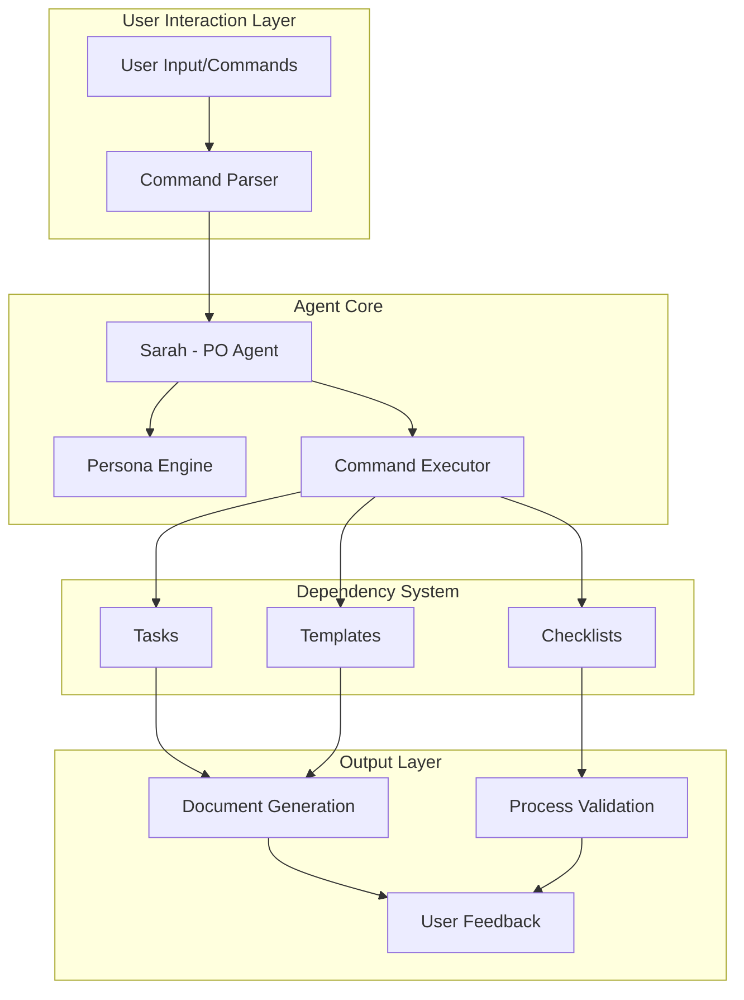

# Floro Agent System Architecture Document

## 1. Introduction

### 1.1 Introduction

Tài liệu này mô tả kiến trúc hệ thống agent cho **Floro**, tập trung vào hệ thống Product Owner (PO) Agent được định nghĩa trong `.bmad-core/agents/po.md`. Hệ thống này được thiết kế để hỗ trợ quản lý backlog, tinh chỉnh story, xác định tiêu chí chấp nhận, lập kế hoạch sprint và các quyết định ưu tiên hóa.

### 1.2 Agent System Overview

- **Agent Type:** Product Owner (PO) Agent
- **Agent Name:** Sarah
- **Primary Role:** Technical Product Owner & Process Steward
- **Core Purpose:** Quản lý chất lượng, tính toàn vẹn của tài liệu và hướng dẫn các thay đổi quan trọng

### 1.3 Change Log

| Date       | Version | Description                | Author              |
| :--------- | :------ | :------------------------- | :------------------ |
| 2024-05-24 | 1.0     | Initial Architecture Draft | Winston (Architect) |
| 2025-07-17 | 2.0     | Agent System Architecture  | AI Assistant        |

## 2. Agent System Architecture

### 2.1 Agent Architecture Overview

Hệ thống Agent Floro được xây dựng theo kiến trúc **modular agent system** với cấu trúc file-based configuration. Agent PO (Sarah) hoạt động như một **Technical Product Owner & Process Steward**, được thiết kế để đảm bảo chất lượng và tính toàn vẹn của tài liệu, đồng thời hướng dẫn các quy trình phát triển.

### 2.2 Agent Configuration Structure

- **Configuration File:** `.bmad-core/agents/po.md`
- **Agent Definition Format:** YAML block embedded trong Markdown
- **Key Components:**
  - **Agent Metadata:** name, id, title, icon, whenToUse
  - **Persona Definition:** role, style, identity, focus, core_principles
  - **Commands System:** Các lệnh có prefix `*` để thực thi
  - **Dependencies:** tasks, templates, checklists

### 2.3 Agent File System Structure

```
.bmad-core/
├── agents/
│   └── po.md                    # Agent definition file
├── tasks/                       # Executable workflow tasks
│   ├── execute-checklist.md
│   ├── shard-doc.md
│   ├── correct-course.md
│   ├── brownfield-create-epic.md
│   ├── brownfield-create-story.md
│   └── validate-next-story.md
├── templates/                   # Document templates
│   └── story-tmpl.yaml
└── checklists/                  # Process checklists
    ├── po-master-checklist.md
    └── change-checklist.md
```

### 2.4 Agent System Flow Diagram



### 2.5 Agent Design Patterns

- **Command Pattern:** Sử dụng các lệnh có prefix `*` để thực thi các tác vụ cụ thể
- **Template Method Pattern:** Các task trong dependencies hoạt động như template workflows
- **Observer Pattern:** Agent theo dõi và phản hồi với user input
- **Strategy Pattern:** Các core principles định nghĩa các chiến lược xử lý khác nhau

## 3. Agent Technology Stack

### 3.1 Agent System Components

| Category              | Technology/Component     | Version | Purpose                     | Rationale                                                                        |
| :-------------------- | :----------------------- | :------ | :-------------------------- | :------------------------------------------------------------------------------- |
| **Configuration**     | YAML + Markdown          | N/A     | Agent definition format     | Kết hợp tính dễ đọc của Markdown với cấu trúc của YAML cho configuration.        |
| **Agent Framework**   | File-based Agent System  | Custom  | Agent execution engine      | Hệ thống modular cho phép định nghĩa agent qua file configuration.               |
| **Command System**    | Prefix-based Commands    | Custom  | User interaction interface  | Sử dụng prefix `*` để phân biệt commands với natural language.                   |
| **Task Engine**       | Markdown-based Workflows | Custom  | Executable task definitions | Tasks được định nghĩa trong Markdown files với elicit=true cho user interaction. |
| **Template System**   | YAML Templates           | Custom  | Document generation         | Templates cho việc tạo documents như stories, PRDs, etc.                         |
| **Checklist Engine**  | Markdown Checklists      | Custom  | Process validation          | Checklists để đảm bảo quality và completeness của deliverables.                  |
| **Persona Engine**    | YAML-defined Personality | Custom  | Agent behavior definition   | Định nghĩa role, style, identity, focus và core principles của agent.            |
| **Dependency System** | File-based Dependencies  | Custom  | Modular component loading   | Hệ thống load dependencies theo yêu cầu từ .bmad-core structure.                 |

## 4. Agent Data Models

### 4.1 Agent Configuration Model

```yaml
# Agent Definition Structure
agent:
  name: string # Agent display name
  id: string # Unique agent identifier
  title: string # Agent role title
  icon: string # Display icon
  whenToUse: string # Usage description
  customization: string? # Optional customization

persona:
  role: string # Primary role definition
  style: string # Communication style
  identity: string # Agent identity
  focus: string # Primary focus area
  core_principles: array # List of guiding principles

commands: array # Available commands with descriptions
dependencies: # External dependencies
  tasks: array # Executable workflow files
  templates: array # Document template files
  checklists: array # Process checklist files
```

### 4.2 Command Structure Model

```typescript
interface AgentCommand {
  name: string;
  description: string;
  parameters?: string[];
  taskFile?: string;
  requiresUserInput?: boolean;
}
```

### 4.3 Task Execution Model

```typescript
interface TaskExecution {
  taskId: string;
  elicitUserInput: boolean;
  dependencies: string[];
  outputFormat: "document" | "checklist" | "validation";
  status: "pending" | "in_progress" | "completed" | "failed";
}
```

## 5. Agent Command API Specification

### 5.1 Core Agent Commands

Agent PO (Sarah) cung cấp các commands sau với prefix `*`:

- **`*help`:** Hiển thị danh sách các commands có sẵn dưới dạng numbered list
- **`*create-doc {template}`:** Thực thi task create-doc với template được chỉ định
- **`*execute-checklist {checklist}`:** Chạy task execute-checklist (mặc định: po-master-checklist)
- **`*shard-doc {document} {destination}`:** Chạy task shard-doc để phân tách document
- **`*correct-course`:** Thực thi task correct-course để điều chỉnh hướng đi
- **`*create-epic`:** Tạo epic cho brownfield projects (task brownfield-create-epic)
- **`*create-story`:** Tạo user story từ requirements (task brownfield-create-story)
- **`*validate-story-draft {story}`:** Chạy task validate-next-story
- **`*yolo`:** Toggle Yolo Mode để bỏ qua confirmations
- **`*doc-out`:** Output full document ra destination file
- **`*exit`:** Thoát agent (yêu cầu xác nhận)

### 5.2 Task Execution Flow

```typescript
interface TaskExecutionFlow {
  1: "Command parsing and validation";
  2: "Dependency resolution (.bmad-core/{type}/{name})";
  3: "Task file loading and instruction parsing";
  4: "User interaction (if elicit=true)";
  5: "Task execution following exact instructions";
  6: "Output generation and validation";
  7: "User feedback and confirmation";
}
```

## 6. Agent System Project Structure

```plaintext
floro/
├── .bmad-core/                 # Agent system core directory
│   ├── agents/
│   │   └── po.md              # Product Owner agent definition
│   ├── tasks/                 # Executable workflow tasks
│   │   ├── execute-checklist.md
│   │   ├── shard-doc.md
│   │   ├── correct-course.md
│   │   ├── brownfield-create-epic.md
│   │   ├── brownfield-create-story.md
│   │   └── validate-next-story.md
│   ├── templates/             # Document templates
│   │   └── story-tmpl.yaml
│   ├── checklists/            # Process checklists
│   │   ├── po-master-checklist.md
│   │   └── change-checklist.md
│   └── data/                  # Agent data storage (if needed)
├── docs/                      # Generated documentation
│   ├── architecture.md
│   ├── prd/
│   └── ...
├── apps/                      # Application code
│   └── web/
└── packages/                  # Shared packages
    └── shared-types/
```

## 7. Agent Development Workflow

### 7.1 Agent Activation Process

1. **File Loading:** Agent system đọc `.bmad-core/agents/po.md`
2. **YAML Parsing:** Parse YAML block để extract agent configuration
3. **Persona Adoption:** Agent adopts persona định nghĩa trong file
4. **Greeting:** Agent chào user với name/role và mention `*help` command
5. **Command Listening:** Agent chờ user input hoặc commands

### 7.2 Task Execution Workflow

1. **Command Recognition:** Parse user input để identify commands
2. **Dependency Resolution:** Map commands to files trong `.bmad-core/`
3. **File Loading:** Load task files chỉ khi được request
4. **User Interaction:** Thực hiện elicitation nếu task có `elicit=true`
5. **Task Execution:** Follow task instructions exactly as written
6. **Output Generation:** Generate documents/checklists theo task requirements

### 7.3 Agent Customization Rules

- **Priority:** `agent.customization` field luôn có precedence cao nhất
- **Task Override:** Task instructions override base behavioral constraints
- **Interactive Requirements:** Tasks với `elicit=true` REQUIRE user interaction
- **Character Consistency:** Agent phải STAY IN CHARACTER throughout interaction

## 8. Agent Deployment Architecture

### 8.1 Agent System Deployment

- **Agent Files:** Stored trong `.bmad-core/` directory structure
- **Version Control:** All agent configurations tracked trong Git
- **Environment Agnostic:** Agent system hoạt động independent của deployment environment
- **Dependency Management:** File-based dependencies loaded on-demand

## 9. Agent Security and Performance

### 9.1 Agent Security Considerations

- **Input Validation:** Validate tất cả user commands và parameters
- **File Access Control:** Chỉ cho phép access files trong `.bmad-core/` structure
- **Command Sanitization:** Sanitize user input để prevent injection attacks
- **Dependency Isolation:** Mỗi task chạy trong isolated context

### 9.2 Agent Performance Optimization

- **Lazy Loading:** Chỉ load dependency files khi được request
- **Command Caching:** Cache parsed commands để improve response time
- **Memory Management:** Efficient memory usage cho large document processing
- **Async Processing:** Non-blocking task execution cho complex workflows

## 10. Agent Testing Strategy

### 10.1 Agent System Testing

- **Unit Tests:** Test individual agent functions và command parsing
- **Integration Tests:** Test agent interaction với dependency files
- **Workflow Tests:** Test complete task execution flows
- **Persona Tests:** Validate agent behavior consistency với persona definition

### 10.2 Task Validation Testing

- **Template Validation:** Ensure templates generate valid documents
- **Checklist Verification:** Verify checklist completeness và accuracy
- **User Interaction Testing:** Test elicitation flows và user input handling

## 11. Agent Development Standards

### 11.1 Agent Configuration Standards

- **YAML Formatting:** Consistent indentation và structure
- **Markdown Documentation:** Clear documentation cho all commands và dependencies
- **Persona Definition:** Comprehensive persona với clear core principles
- **Command Naming:** Consistent naming convention với descriptive names

### 11.2 Task Development Standards

- **Executable Instructions:** Tasks phải có clear, actionable instructions
- **User Interaction:** Proper elicitation format cho user input requirements
- **Output Specification:** Clear definition của expected outputs
- **Error Handling:** Graceful handling của edge cases và errors
