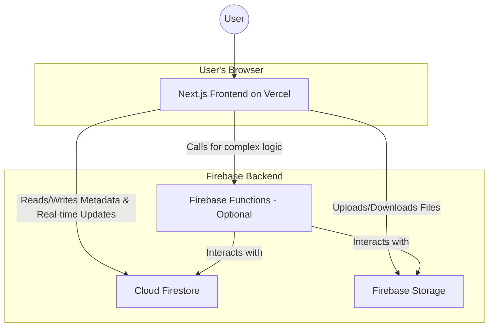

# Floro Fullstack Architecture Document

## 1. Introduction

### 1.1 Introduction

This document outlines the complete fullstack architecture for **Floro**, including the Next.js frontend, Firebase backend, và sự tích hợp giữa chúng. It serves as the single source of truth for AI-driven development, ensuring consistency across the entire technology stack. This unified approach is designed to streamline development for modern fullstack applications where frontend and backend concerns are increasingly intertwined.

### 1.2 Starter Template or Existing Project

- **N/A - Greenfield project:** Dự án này sẽ được xây dựng từ đầu, không dựa trên một template có sẵn. Chúng ta sẽ tuân theo các best practice của Next.js và Firebase.

### 1.3 Change Log

| Date       | Version | Description                | Author              |
| :--------- | :------ | :------------------------- | :------------------ |
| 2024-05-24 | 1.0     | Initial Architecture Draft | Winston (Architect) |

## 2. High-Level Architecture

### 2.1 Technical Summary

Hệ thống Floro sẽ được xây dựng theo kiến trúc **Jamstack hiện đại kết hợp với backend serverless**, tận dụng sức mạnh của Next.js cho frontend và hệ sinh thái Firebase cho backend. Người dùng sẽ tương tác với một ứng dụng Next.js được host trên Vercel. Mọi dữ liệu về trạng thái không gian làm việc (vị trí node, metadata) và các cập nhật thời gian thực sẽ được xử lý qua **Cloud Firestore**. Các file dung lượng lớn như ảnh và tài liệu sẽ được lưu trữ trên **Firebase Storage**. Kiến trúc này được thiết kế để tối ưu hóa tốc độ tải trang, khả năng mở rộng linh hoạt và giảm thiểu chi phí vận hành, hoàn toàn phù hợp với các mục tiêu trong PRD.

### 2.2 Platform and Infrastructure Choice

- **Platform:** Vercel + Firebase.
- **Key Services:**
  - **Vercel:** Hosting cho ứng dụng Next.js, CI/CD, và có thể cả Edge Functions.
  - **Firebase:**
    - **Cloud Firestore:** Cơ sở dữ liệu NoSQL để lưu trữ metadata của node và đồng bộ real-time.
    - **Firebase Storage:** Lưu trữ các đối tượng file (ảnh, tài liệu, v.v.).
    - **Firebase Hosting (for CDN):** Có thể sử dụng để phân phối nội dung tĩnh một cách hiệu quả.
- **Deployment Regions:** Sẽ được cấu hình để phục vụ người dùng toàn cầu với độ trễ thấp, tận dụng mạng lưới của Vercel và Google Cloud.

### 2.3 Repository Structure

- **Structure:** Monorepo.
- **Monorepo Tool:** Sử dụng `npm workspaces` hoặc `pnpm workspaces` để quản lý.
- **Package Organization:**
  - `apps/web`: Chứa ứng dụng Next.js.
  - `packages/shared-types`: Chứa các định nghĩa TypeScript (interfaces) được dùng chung giữa frontend và các function backend (nếu có), đảm bảo sự nhất quán.

### 2.4 High-Level Architecture Diagram



### 2.5 Architectural Patterns

- **Component-Based UI:** Sử dụng React components có thể tái sử dụng để xây dựng giao diện người dùng.
- **Repository Pattern (phía client):** Tạo một lớp trừu tượng (service layer) để giao tiếp với Firebase, giúp cho các component không cần biết chi tiết về logic của Firestore hay Storage.
- **Observer Pattern (Real-time):** Tận dụng cơ chế lắng nghe (onSnapshot) của Firestore để tự động cập nhật UI khi có dữ liệu mới từ server.

## 3. Tech Stack

### 3.1 Technology Stack Table

| Category               | Technology                   | Version | Purpose                        | Rationale                                                                                     |
| :--------------------- | :--------------------------- | :------ | :----------------------------- | :-------------------------------------------------------------------------------------------- |
| **Language**           | TypeScript                   | `~5.x`  | Ngôn ngữ phát triển chính      | An toàn kiểu dữ liệu, dễ dàng chia sẻ types giữa các gói trong monorepo.                      |
| **Frontend Framework** | Next.js                      | `~14.x` | Xây dựng giao diện người dùng  | Framework React mạnh mẽ, tích hợp tốt với Vercel, hỗ trợ SSR/SSG.                             |
| **Backend Service**    | Firebase                     | `~10.x` | Backend-as-a-Service           | Cung cấp Firestore, Storage, và Functions, tối ưu cho real-time và chi phí.                   |
| **Database**           | Cloud Firestore              | N/A     | Lưu trữ metadata và trạng thái | Cơ sở dữ liệu NoSQL, real-time, có khả năng mở rộng tốt và tích hợp sâu với Firebase.         |
| **File Storage**       | Firebase Storage             | N/A     | Lưu trữ file                   | Tối ưu hóa cho việc lưu trữ và phân phối file dung lượng lớn, bảo mật và hiệu quả.            |
| **UI Library**         | Tailwind CSS                 | `~3.x`  | Styling                        | Cung cấp các lớp tiện ích (utility classes) giúp xây dựng giao diện nhanh chóng và nhất quán. |
| **UI Components**      | Shadcn/ui                    | Latest  | Thư viện component             | Cung cấp các component có thể tái sử dụng, đẹp và dễ tùy chỉnh, xây dựng trên Tailwind.       |
| **State Management**   | Zustand                      | `~4.x`  | Quản lý trạng thái client      | Nhẹ, đơn giản, hiệu quả hơn so với Redux cho các nhu cầu của dự án này.                       |
| **2D Canvas Library**  | Konva.js                     | `~9.x`  | Xử lý không gian 2D            | Thư viện canvas hiệu suất cao, hỗ trợ tốt cho các đối tượng, lớp và sự kiện phức tạp.         |
| **Testing**            | Jest & React Testing Library | Latest  | Unit & Integration tests       | Bộ công cụ tiêu chuẩn trong hệ sinh thái React để kiểm thử component và logic.                |
| **Deployment**         | Vercel                       | N/A     | Nền tảng hosting               | Tích hợp liền mạch với Next.js, cung cấp CI/CD tự động và mạng lưới toàn cầu.                 |

## 4. Data Models

_Các mô hình dữ liệu này sẽ được định nghĩa trong `packages/shared-types/src/index.ts`_

**BaseNode:**

```typescript
interface BaseNode {
  id: string;
  sessionId: string;
  type: "file" | "text" | "link" | "image";
  position: { x: number; y: number };
  size: { width: number; height: number };
  createdAt: Timestamp;
}
```

**FloroNode (Union Type):**

```typescript
export type FloroNode = FileNode | TextNode | LinkNode | ImageNode;
```

**Cursor:**

```typescript
interface Cursor {
  id: string;
  position: { x: number; y: number };
  lastUpdate: Timestamp;
}
```

## 5. API Specification (Client-Side Service Layer)

Logic giao tiếp với Firebase sẽ được đóng gói trong các file dịch vụ tại `apps/web/src/services/`.

- **`firebase.ts`:** Khởi tạo Firebase.
- **`node.service.ts`:**
  - `listenToNodes()`: Lắng nghe cập nhật node từ Firestore.
  - `addNode()`: Thêm node mới.
  - `updateNodePosition()`: Cập nhật vị trí node.
- **`storage.service.ts`:**
  - `uploadFile()`: Tải file lên Firebase Storage.
  - `uploadImageFromBlob()`: Tải ảnh từ clipboard.
- **`realtime.service.ts`:**
  - `updateCursorPosition()`: Cập nhật vị trí con trỏ (dùng Realtime DB).
  - `listenToCursors()`: Lắng nghe vị trí các con trỏ khác.

## 6. Unified Project Structure

```plaintext
floro/
├── apps/
│   └── web/                    # Ứng dụng Next.js
│       ├── src/
│       │   ├── app/            # App Router
│       │   ├── components/
│       │   │   ├── canvas/
│       │   │   └── nodes/
│       │   ├── services/
│       │   ├── hooks/
│       │   └── store/
│       └── ...
├── packages/
│   └── shared-types/           # Gói chứa types dùng chung
│       └── src/
│           └── index.ts
├── package.json
└── pnpm-workspace.yaml
```

## 7. Development Workflow

### 7.1 Local Development Setup

1.  Clone repository.
2.  Chạy `pnpm install`.
3.  Tạo file `.env.local` trong `apps/web` và điền cấu hình Firebase.
4.  Chạy `pnpm dev`.

### 7.2 Environment Configuration

File `.env.local` chứa các biến `NEXT_PUBLIC_FIREBASE_*`.

## 8. Deployment Architecture

- **Frontend:** Host trên Vercel, kết nối với GitHub để CI/CD tự động.
- **Backend:** Sử dụng các dịch vụ của Firebase, triển khai Security Rules qua Firebase CLI.
- **Environments:** Development (local), Preview (cho mỗi PR), và Production (nhánh main).

## 9. Security and Performance

### 9.1 Security Requirements

- Triển khai Firebase Security Rules để kiểm soát việc đọc/ghi dữ liệu.
- Sử dụng Rate Limiting để chống spam.
- "Làm sạch" (sanitize) mọi nội dung do người dùng tạo ra để chống XSS.

### 9.2 Performance Optimization

- **Canvas Virtualization:** Chỉ render các node trong khung nhìn.
- **Level of Detail (LOD):** Render node với chi tiết thấp hơn khi zoom xa.
- **Lazy Loading:** Chỉ tải ảnh khi chúng xuất hiện trong khung nhìn.
- **Firestore Indexes:** Tối ưu hóa các truy vấn dựa trên vị trí.

## 10. Testing Strategy

- **Unit Tests (Jest):** Cho các logic nghiệp vụ và hàm tiện ích. Mock các dịch vụ Firebase.
- **Integration Tests (React Testing Library):** Cho sự tương tác giữa các component.
- **E2E Tests (Cypress/Playwright):** Cho các luồng người dùng chính (sau MVP).

## 11. Coding Standards

- Sử dụng TypeScript `strict` mode.
- Chia sẻ types qua `packages/shared-types`.
- Tách biệt logic nghiệp vụ ra khỏi UI.
- Sử dụng Prettier và ESLint để đảm bảo code nhất quán.
- Đặt tên theo quy ước (PascalCase cho components, camelCase cho hooks/services).
