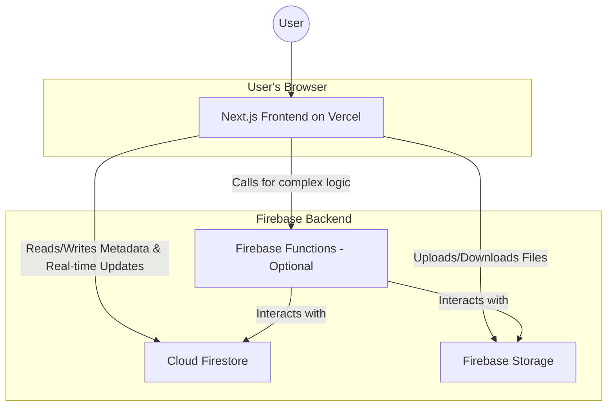

# 2. High-Level Architecture

### 2.1 Technical Summary

Hệ thống Floro sẽ được xây dựng theo kiến trúc **Jamstack hiện đại kết hợp với backend serverless**, tận dụng sức mạnh của Next.js cho frontend và hệ sinh thái Firebase cho backend. Người dùng sẽ tương tác với một ứng dụng Next.js được host trên Vercel. Mọi dữ liệu về trạng thái không gian làm việc (vị trí node, metadata) và các cập nhật thời gian thực sẽ được xử lý qua **Cloud Firestore**. Các file dung lượng lớn như ảnh và tài liệu sẽ được lưu trữ trên **Firebase Storage**. Kiến trúc này được thiết kế để tối ưu hóa tốc độ tải trang, khả năng mở rộng linh hoạt và giảm thiểu chi phí vận hành, hoàn toàn phù hợp với các mục tiêu trong PRD.

### 2.2 Platform and Infrastructure Choice

- **Platform:** Vercel + Firebase.
- **Key Services:**
  - **Vercel:** Hosting cho ứng dụng Next.js, CI/CD, và có thể cả Edge Functions.
  - **Firebase:**
    - **Cloud Firestore:** Cơ sở dữ liệu NoSQL để lưu trữ metadata của node và đồng bộ real-time.
    - **Firebase Storage:** Lưu trữ các đối tượng file (ảnh, tài liệu, v.v.).
    - **Firebase Hosting (for CDN):** Có thể sử dụng để phân phối nội dung tĩnh một cách hiệu quả.
- **Deployment Regions:** Sẽ được cấu hình để phục vụ người dùng toàn cầu với độ trễ thấp, tận dụng mạng lưới của Vercel và Google Cloud.

### 2.3 Repository Structure

- **Structure:** Monorepo.
- **Monorepo Tool:** Sử dụng `npm workspaces` hoặc `pnpm workspaces` để quản lý.
- **Package Organization:**
  - `apps/web`: Chứa ứng dụng Next.js.
  - `packages/shared-types`: Chứa các định nghĩa TypeScript (interfaces) được dùng chung giữa frontend và các function backend (nếu có), đảm bảo sự nhất quán.

### 2.4 High-Level Architecture Diagram

### 2.5 Architectural Patterns

- **Component-Based UI:** Sử dụng React components có thể tái sử dụng để xây dựng giao diện người dùng.
- **Repository Pattern (phía client):** Tạo một lớp trừu tượng (service layer) để giao tiếp với Firebase, giúp cho các component không cần biết chi tiết về logic của Firestore hay Storage.
- **Observer Pattern (Real-time):** Tận dụng cơ chế lắng nghe (onSnapshot) của Firestore để tự động cập nhật UI khi có dữ liệu mới từ server.

